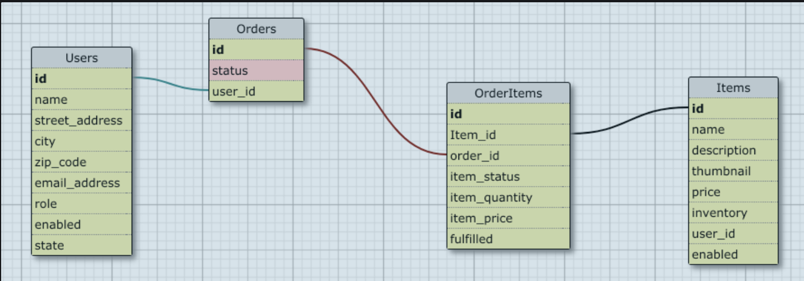

[](https://waffle.io/stoic-plus/LittleShop)

# Little Shop of Horrors

BE Mod 2 Group Project

Contributors: Nico, Ricardo, Leah, & Tony

## Background and Description
"Little Shop of Orders" is a fictitious e-commerce platform where users can register to place items into a shopping cart and checkout. Merchant users can mark items as 'fulfilled,' and Admin users can mark orders as 'complete.'  Each user role has access to some or all CRUD functionality for application models.

## Our Inspiration
Burson Fouch: "I remember in one flower shop there was a whole wall covered with poison ivy. People came from miles around to look at that wall and they stayed to buy."

Gravis Mushnik: "And the owner got rich?"

Burson Fouch: "No, he scratched himself to death in an insane asylum."

So that sequence isn't exactly what inspires us, but we did use the premise of this 1960s film to develop our quaint, creepy, little shop.  Our hope is that when we're all successful developers one day, we'll have a movie marathon and watch the original and the musical version from 1986 back-to-back.  Oh, what a glorious day that will be.

## Learning Goals
- Advanced Rails routing (nested resources and namespacing)
- Advanced ActiveRecord for calculating statistics
- Average HTML/CSS layout and design for UX/UI
- Session management and use of POROs for shopping cart
- Authentication, Authorization, separation of user roles and permissions

## A Peak into our Code:

### Database Schema


### Nested Resources and Namespacing
It took some concentration; however, we're pleased with our route names and authorization game plan.  This is an example of some of what we put together:
```
namespace :admin do
  resources :merchants, only: [:index, :show]
  resources :users, only: [:index, :show]
  get '/profile', to: 'admin_users#show'
  post '/toggle', to: "merchants#toggle_status"
  post '/toggle-user', to: "users#toggle_user"
end

namespace :profile do
  resources :orders, only: [:index, :show]
end
```
### ActiveRecord
We've been working diligently on our ActiveRecord skills throughout this module, and the work we've put in definitely served us well in this project, allowing us to keep DRY and scalable code:
```
def self.popular_items(top_or_bottom, amount)
    order = top_or_bottom == :top ? "desc" : "asc"

    joins(:order_items)
      .where("order_items.fulfilled = true")
      .group(:id)
      .order("item_count #{order}")
      .limit(amount)
      .select("items.*, sum(quantity) as item_count")
end
```

## Design
We're lucky to have a resident front-end expert on our team, and we certainly leaned on his skills for our layout.  Creepy and user-friendly were our top-two priorities.

## POROs
Our entire class seemed to muse over the last time we'd needed to type the word 'initialize.' Was it this module, was it last module, did we ever actually type it?  Time is not a real concept at Turing, but Ruby objects are, and we enjoyed getting back to our roots a little with this:
```
attr_reader :data
def initialize(input_data = nil)
  @data = input_data || Hash.new
end
```

## Authentication & Authorization
Some of the requirements surrounding this functionality are listed below in Visitor Roles.  We used enums in our Models and before_actions in our Controllers to help us easily identify and authorize our clients.

## Testing
We used RSpec for testing and kept track of our test coverage through SimpleCov

## Access
We deployed our site via Heroku.  If you'd like to take a live look, please visit: https://little-horrors.herokuapp.com/

## Setup
Do you see changes you'd like to make?  Please feel free to fork and clone our repository: https://github.com/stoic-plus/LittleShop
Don't forget to `bundle install/update` & run your migrations in order to get the most up-to-date seed data.

## Project Requirements
- must use Rails 5.1.x
- must use PostgreSQL
- must use 'bcrypt' for authentication
- all controller and model code must be tested via feature tests and model tests, respectively
- must use good GitHub branching, team code reviews via GitHub comments, and use of a project planning tool like waffle.io
- must include a thorough README to describe their project

## Permitted
- use FactoryBot to speed up your test development
- use "rails generators" to speed up your app development

## Not Permitted
- do not use JavaScript for pagination or sorting controls

## Permission
- if there is a specific gem you'd like to use in the project, please get permission from your instructors first

## User Roles
1. Visitor - this type of user is anonymously browsing our site and is not logged in
2. Registered User - this user is registered and logged in to the application while performing their work; can place items in a cart and create an order
3. Merchant User - a registered user who is also has access to merchant data and operations; user is logged in to perform their work
4. Admin User - a registered user (but cannot also be a merchant) who has "superuser" access to all areas of the application; user is logged in to perform their work

## Order Status
1. 'pending' means a user has placed items in a cart and "checked out", but no merchant had fulfilled any items yet
2. 'processing' means one or more merchants have fulfilled items from the order
3. 'complete' means all merchants have fulfilled their items for the order
4. 'cancelled' only 'pending' and 'processing' orders can be cancelled

## Not Everything can be FULLY Deleted
In the user stories, we talk about "CRUD" functionality. However, it's rare in a real production system to ever truly delete content, and instead we typically just 'enable' or 'disable' content. Users, items and orders can be 'enabled' or 'disabled' which blocks functionality (users whose accounts are disabled should not be allowed to log in, items which are disabled cannot be ordered, orders which are disabled cannot be processed, and so on).

Disabled content should also be restricted from showing up in the statistics pages. For example if a user is disabled they should not appear in a list of "users with most orders"; if an order is disabled it should not be considered as part of "top sales" and so on.
